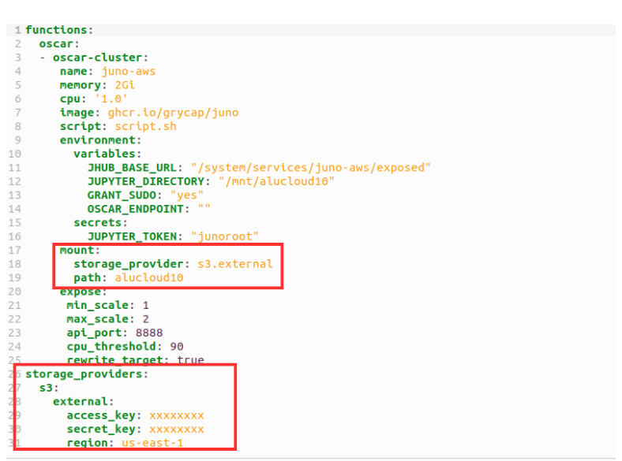
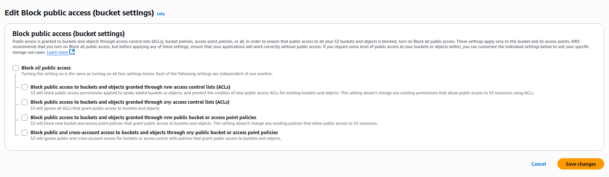
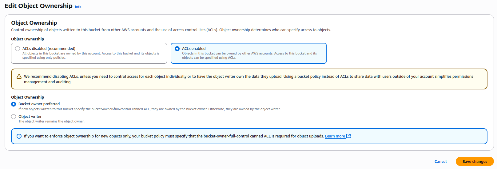

To deploy an exposed **Jupyter Notebook** service mounted on an S3 bucket, we must keep two things in mind:

- Create the service with the appropriate FDL.
- Create a bucket in S3.

When creating the service according to the [Jupyter](https://github.com/grycap/oscar-juno) repository, in the FDL, we must modify the `mount` with a `storage_providers` type of S3 and in the `path`, enter the name of the S3 bucket to be used. Additionally, in the storage_providers section, the S3 object must be created with the user's AWS credentials (`access_key` and `secret_key`).

In the S3 bucket, we must modify the default bucket configuration. In the `permissions`, we disable `Block all public access`.

In `Object Ownership`, we enable ACLs according to the configuration shown in the figure.

